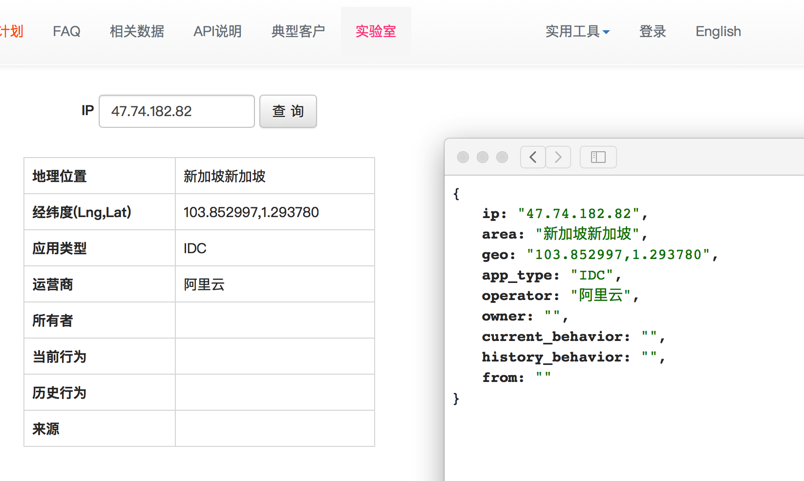

ip地址归属地查询api

数据来源 [ipip.net](http://www.ipip.net) 😂😂  [ip138.com](http://ip138.com) 😅😅

### 用法

1. 安装nodejs

   推荐：[用包管理的方式安装nodejs](https://nodejs.org/en/download/package-manager/)

2. 安装pm2守护进程模块

   ```
   $ sudo npm install pm2 -g
   ```

3. 下载本仓库

   ```
   $ git clone https://github.com/elsonwx/ip_location_api.git
   ```

4. 安装依赖

   ```
   $ cd ip_location_api && npm install
   ```

5. 修改api启动后监听的端口号（别忘了在机器的防火墙规则上允许此端口号）

   修改 `pm2_start_config.json` 中的 `PORT` 即可，默认为3001

6. 启动api

   ```
   $ pm2 start pm2_start_config.json
   ```

7. 测试访问

   - ip138

     http://api.elsonwx.com:3001/ip138/me

     http://api.elsonwx.com:3001/ip138/1.2.3.4

   - ipipnet

     http://api.elsonwx.com:3001/ipipnet/me

     http://api.elsonwx.com:3001/ipipnet/1.2.3.4

   把 `api.elsonwx.com` 换成 `你的ip或域名` ，把 `3001` 换成 `你设置的监听端口` ，把  `1.2.3.4` 换成 `你要查询的ip地址`


## 更新

[ipip.net实验室api](https://labs.ipip.net/security/)

http://api.elsonwx.com:3001/ipipnet/lab/1.2.3.4



